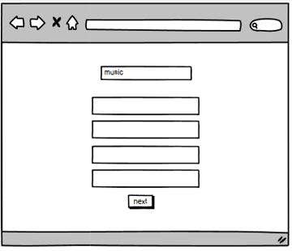
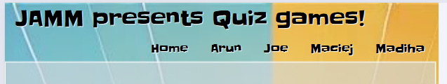
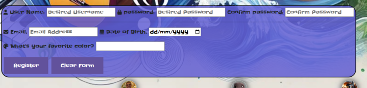

# Quiz Games
This project is a part of Hackathon1. Members of this team developed together 4 different type of Quiz which you can select according to your mood and requirement. Mental Health, Music, Forex and General Knowledge quiz. Quiz Games is a first hackathone project developed as part of the Code Institute Full Stack Software Developer Bootcamp, consisting of learning outcomes to utilise HTML5, CSS3 & Bootstrap and agile methodology in order to fulfil the necessary requirements.

The live project can found here: <a href="https://arunvg1963.github.io/Hackathon1/" rel="nofollow">Quiz Games</a>

## User Stories

+ Wants an interactive Front-End web application using HTML, CSS and JavaScript based on the principles of user experience design, accessibility, and responsivity.
+ Wants to create a site Using an Agile methodology to plan and design a Front-End Web application.
+ Wants to Maximise future maintainability through documentation, code structure, and organisation.
+ Responsive design that adheres to all necessary standards and accessibility requirements.
+ Use an Agile methodology to plan and design a Front End Web application.
+ The site’s users want to play an online quiz to test general/specific knowledge such as sports/movies/literary knowledge or personality assessment.
+ User stories board is added to demonstrate all issues created before the development of website.

# Wireframes
1. Main Page

2. Mental Health

3. Music (Joe)

4. Forex

5. General Knowledge

# Design
## Responsivity
site is responsive on all type of devices

## Color
Color selection is a key component to any design process, General Knowledge Quiz requires to show bright beautifull colors. The artwork and color selection thus played a integral part in the design of this project as they were essential in creating a welcoming and appropriate page for the end user and their specific needs.

## Fonts

As with color, font was a big consideration for ensuring a positive user experience whilst visiting the page.
different fonts were selected for different quizes. fonts were selected through Google Fonts using a direct import code within the style.css file.

## Features
#### General Features
In order to fulfil the criteria the page consists of various sectioned information and links that contribute to a positive user experience.
javascript functionality is added on all pages of the website. All 4 quizzes are created by using javascript tools and functions.

 ###### Navigation
 

Within this section buttons are added to present easy navigation options for the user to access the relevant section of the page for their needs.

##### Footer
For the footer Github links were added.

## Technologies Used
#### Languages Used
+ HTML5
+ CSS3
+ javascript
#### Frameworks, Libraries, Technologies & Programs Used
+ GitHub - used to save and store all files for this website
+ Git - used for version control
+ Google Fonts - fonts were imported from here
+ Google Dev Tools - to debug and for testing responsiveness
+ W3C Validator - for validating the HTML and CSS code
+ 
## Deployment
### How to Deploy
GitHub was used to deploy the website. These were the steps taken to acheive this:

1. Login to GitHub account
2. Navigate to the project repository, project-1-safeguarding-bgg
3. Click the Settings button near the top of the page
4. In the left-hand menu, find and click on the Pages button
5. In the Source section, choose 'main' from the drop-down, select branch menu
6. Select 'root' from the drop-down folder menu
7. Click 'Save' and after a few moments the project will have been made live and a link is visible at the top of the page

## Acknowledgements
1. We would like to acknowledge our Code Institute facilitator, Vasi Pavaloi, for his supporting presence and advice.
2. We are gratefull for our coding coach "John Rearden" and SME "Mark Briscoe" for help, generoisty and support.
2. We  would like to acknowledge our collegues of code Institute for their help and support.
